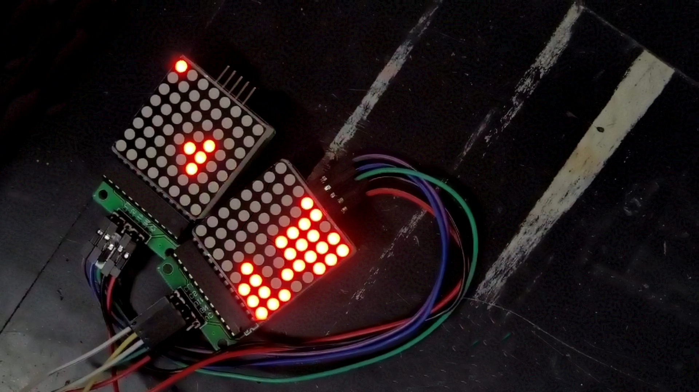

# MicroArcade
O projeto foi feito para o componente curricular de microcontroladores experimental.

Os códigos foram feitos utilizado o Atmel Studio e as simulações utilizaram o SimulIDE.

Uma demonstração do funcionamento do jogo Tetris pode ser vista no seguinte vídeo.

